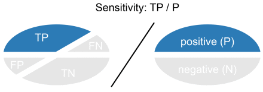
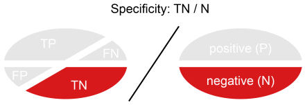
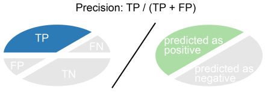
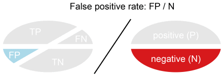
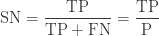
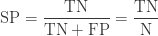
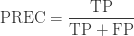
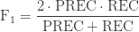
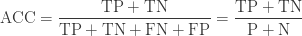
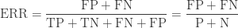

## Creating Machine Learning Classifiers for Nonprofit Mission Statements

A tutorial about using mission and program service accomplishment text to predict mission activity codes such as the NTEE.


## Interpretation

  
  
  
  

| METRIC                 |  FORMULA                     |
|------------------------|------------------------------|
|  Sensitivity           |   |
|  Specificity           |   |
|  Precision             |   |
|  Recall                |   |
|  F1                    |   |
|  Accuracy              |    |
|  Error                 |    |


```
## Confusion Matrix and Statistics
##
##                        predicted_class
## actual_class            0            1
##            0   0.82788226   0.04170074
##            1   0.05928046   0.07113655
##
## Sensitivity : 0.9332
## Specificity : 0.6304
## Pos Pred Value : 0.9520
## Neg Pred Value : 0.5455
## Precision : 0.9520
## Recall : 0.9332
## F1 : 0.9425
## Prevalence : 0.8872
## Detection Rate : 0.8279
## Detection Prevalence : 0.8696
## Balanced Accuracy : 0.7818 
```


## Accuracy

We have achieved the follosing success...

## Limitations


## Replication Files

Describe steps in the code...

link to [tutorial step](specification-part-I.html)


## Next Steps
