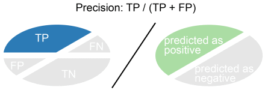

--------------------

## Metrics  

Some commmon metrics  

 
 
 
 

-------

[cite](https://classeval.wordpress.com/introduction/basic-evaluation-measures/)  

--------


| METRIC                 |  FORMULA                     |
|------------------------|------------------------------|
|  Sensitivity           |   |
|  Specificity           |   |
|  Pos Pred Value        |  |
|  Neg Pred Value        |  |
|  Precision             |   |
|  Recall                |   |
|  F1                    |   |
|  Prevalence            |   |
|  Detection Rate        |   |
|  Detection Prevalence  |   |
|  Balanced Accuracy     |   |
|  Accuracy              |    |
|  Error                 |    |


```
## Confusion Matrix and Statistics
##
##                        predicted_class
## actual_class            0            1
##            0   0.82788226   0.04170074
##            1   0.05928046   0.07113655
##
## Sensitivity : 0.9332
## Specificity : 0.6304
## Pos Pred Value : 0.9520
## Neg Pred Value : 0.5455
## Precision : 0.9520
## Recall : 0.9332
## F1 : 0.9425
## Prevalence : 0.8872
## Detection Rate : 0.8279
## Detection Prevalence : 0.8696
## Balanced Accuracy : 0.7818 
```


## Interpretation


Precision is True Positives divided by the number of True Positives and False Positives. Put another way, it is the number of positive predictions divided by the total number of positive class values predicted.

Sensitivity or Recall is the number of True Positives divided by the number of True Positives and the number of False Negatives. Put another way it is the number of positive predictions divided by the number of positive class values in the test data. It is also called the True Positive Rate. Sensitivity can be thought of as a measure of a classifiers completeness. A low recall indicates many False Negatives.

The F1 Score is the 2 * (precision*recall) / (precision+recall) . It is also called the F Score or the F Measure. Put another way, the F1 score conveys the balance between the precision and the recall.

[cite](https://machinelearningmastery.com/classification-accuracy-is-not-enough-more-performance-measures-you-can-use/)


